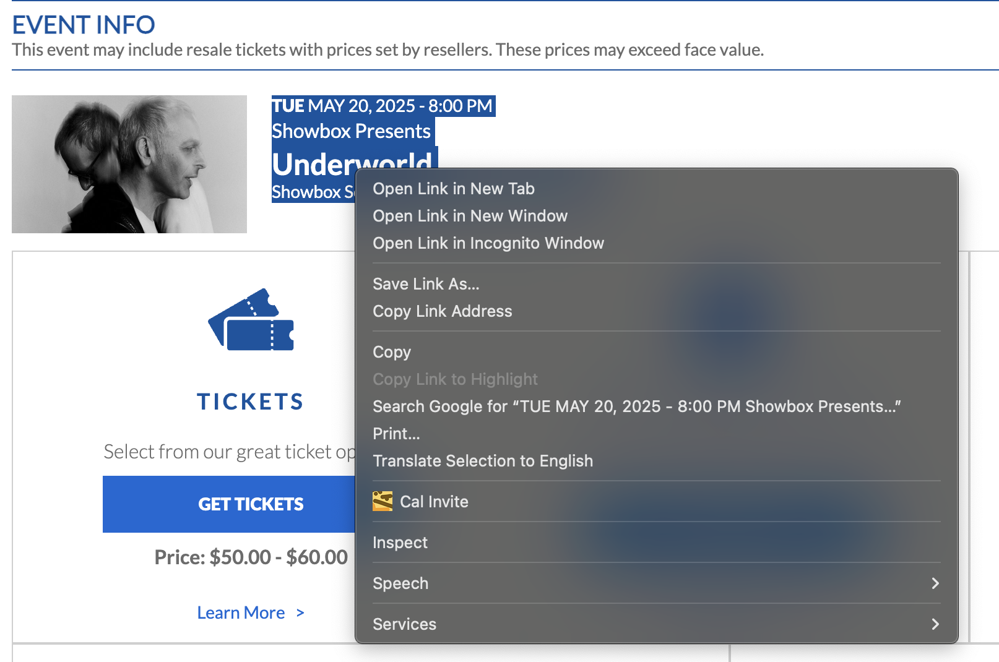

# sel2ics
Select > right click > Generate iCal -> downloads a .ics file you

## Implementation
`sel2ics/` has a rust server that proxies requests to claude, then responds with .ics file contents, eg:

```
$ curl -X POST http://localhost:22137/cal \
  -H "Content-Type: application/json" \
  -d '{"text": "Team meeting tomorrow at 3pm for one hour", "tz": "America/New_York"}'

{
  "name": "Team meeting",
  "start_time": "2023-04-12 15:00:00",
  "end_time": "2023-04-12 16:00:00",
  "duration": "1 hour"
}
```

the other stuff is a shrimple chrome extension:

